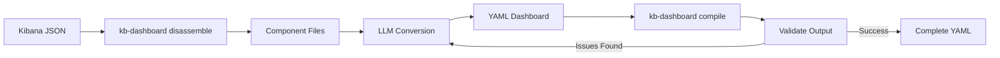

# Dashboard Decompiling Guide: Converting Kibana JSON to YAML

This document provides a complete guide for using LLMs (Large Language Models) to convert existing Kibana dashboard JSON files into the YAML format used by kb-yaml-to-lens.

## Table of Contents

1. [Overview](#overview)
2. [Prerequisites](#prerequisites)
3. [Understanding the Process](#understanding-the-process)
4. [Step-by-Step Workflow](#step-by-step-workflow)
5. [Iterative Conversion Strategy](#iterative-conversion-strategy)
6. [Understanding Defaults](#understanding-defaults)
7. [LLM Prompting Best Practices](#llm-prompting-best-practices)
8. [Validation & Testing](#validation--testing)
9. [Common Issues & Solutions](#common-issues--solutions)
10. [Complete Example Walkthrough](#complete-example-walkthrough)
11. [Advanced Topics](#advanced-topics)

## Overview

### What This Guide Covers

This guide shows you how to convert existing Kibana dashboards (in JSON/NDJSON format) back into human-friendly YAML format. This is the reverse of the normal compilation workflow and is particularly useful when:

- Converting dashboards from the [Elastic Integrations repository](https://github.com/elastic/integrations)
- Migrating existing Kibana dashboards to version-controlled YAML
- Creating YAML templates from existing dashboard designs
- Learning the YAML schema by examining real dashboards

### The Decompilation Workflow



### Key Benefits

- **Incremental Conversion** - Convert one panel at a time, validating as you go
- **Leverage LLM Context** - Use the complete project documentation for accurate conversion
- **Minimal YAML** - LLMs help identify what can be omitted due to defaults
- **Iterative Refinement** - Compile and test frequently to catch issues early

## Prerequisites

| Requirement | Purpose | Notes |
| ----------- | ------- | ----- |
| **kb-yaml-to-lens** | Compilation and disassembly | Install via `uv sync` |
| **LLM Access** | Converting JSON to YAML | Claude Code, ChatGPT, or API access |
| **Source Dashboard** | The dashboard to convert | JSON/NDJSON file or Kibana URL |
| **Basic YAML Knowledge** | Understanding output format | See [Getting Started](index.md) |

### LLM Options

This guide assumes you're using an LLM for conversion. Recommended options:

1. **Claude Code** (recommended) - Native access to this documentation
2. **ChatGPT** - With llms-full.txt provided as context
3. **Claude API** - For automated batch conversions
4. **Other LLMs** - Any model capable of JSON→YAML conversion

## Understanding the Process

### How Decompilation Works

The decompilation process has three main phases:

#### Phase 1: Disassembly

Break the monolithic dashboard JSON into manageable components:

```bash
kb-dashboard disassemble dashboard.ndjson -o output_dir/
```

This creates:

- `metadata.json` - Dashboard metadata (id, title, description)
- `options.json` - Display options (margins, color sync, etc.)
- `controls.json` - Dashboard controls configuration
- `filters.json` - Dashboard-level filters (if present)
- `references.json` - Data view references
- `panels/` - Individual panel JSON files

#### Phase 2: LLM-Based Conversion

Use an LLM to convert each component from JSON to YAML:

1. Provide the LLM with relevant documentation context
2. Show the JSON component to convert
3. Reference similar YAML examples
4. Request minimal YAML (omit defaults)
5. Validate the conversion

#### Phase 3: Validation

Compile and test the YAML to ensure it produces correct output:

```bash
kb-dashboard compile --input-dir my-yaml/ --output-dir compiled/
```

Compare the compiled output with the original dashboard structure.

### Why This Approach Works

**Incremental Validation** - Converting one panel at a time means errors are caught immediately, not after hours of work.

**LLM Documentation Context** - The [llms-full.txt](https://strawgate.com/kb-yaml-to-lens/llms-full.txt) file contains all project documentation, giving LLMs complete context for accurate conversions.

**Pattern Recognition** - LLMs excel at recognizing patterns in existing YAML examples and applying them to new JSON structures.

**Default Inference** - LLMs can compare JSON values against documented defaults and omit unnecessary configuration.

## Step-by-Step Workflow

### Step 1: Obtain the Dashboard JSON

Download the dashboard from Kibana or find it in a repository.

**From a Running Kibana Instance:**

```bash
# Using curl with basic auth
curl -u elastic:password \
  "http://localhost:5601/api/saved_objects/dashboard/your-dashboard-id" \
  > dashboard.ndjson

# Using curl with API key
curl -H "Authorization: ApiKey your-base64-key" \
  "http://localhost:5601/api/saved_objects/dashboard/your-dashboard-id" \
  > dashboard.ndjson
```

**From Elastic Integrations Repository:**

```bash
# Clone the repository
git clone https://github.com/elastic/integrations.git

# Find dashboard files (usually in packages/*/kibana/dashboard/)
find integrations/packages -name "*.json" -path "*/kibana/dashboard/*"
```

### Step 2: Disassemble the Dashboard

Use the disassemble tool to break the dashboard into components:

```bash
kb-dashboard disassemble dashboard.ndjson -o dashboard_parts/
```

**What You'll See:**

```text
dashboard_parts/
├── metadata.json
├── options.json
├── controls.json
├── filters.json
├── references.json
└── panels/
    ├── 000_panel-1_lens.json
    ├── 001_panel-2_markdown.json
    └── 002_panel-3_lens.json
```

### Step 3: Examine the Components

**Start with Metadata:**

```bash
cat dashboard_parts/metadata.json | jq '.'
```

This shows the dashboard title, description, and other high-level information.

**Review Panel Types:**

```bash
ls dashboard_parts/panels/
```

The filenames indicate the panel type (lens, markdown, links, etc.) and help you plan the conversion order.

**Check for Controls and Filters:**

```bash
# Check if controls exist
test -f dashboard_parts/controls.json && echo "Has controls" || echo "No controls"

# Check if filters exist
test -f dashboard_parts/filters.json && echo "Has filters" || echo "No filters"
```

### Step 4: Set Up Your LLM Context

Provide your LLM with the necessary documentation context.

**For Claude Code:**

Claude Code automatically has access to this documentation. Simply start working on the conversion.

**For Other LLMs:**

Download and provide the complete documentation:

```bash
# Download the LLM context file
curl https://strawgate.com/kb-yaml-to-lens/llms-full.txt > llms-full.txt

# Provide this file to your LLM along with your conversion request
```

**Additional Context:**

Reference the [YAML examples](examples/index.md) for pattern matching:

- Simple dashboards in `inputs/`
- Complex dashboards in `docs/examples/aerospike/`

### Step 5: Convert Dashboard Metadata

Start by creating the basic dashboard structure.

**Input (metadata.json):**

```json
{
  "id": "my-dashboard-id",
  "title": "System Metrics Overview",
  "description": "Dashboard showing system performance metrics"
}
```

**Output (config.yaml):**

Create the initial dashboard structure. You'll add panels in the following steps.

```yaml
---
dashboards:
  - name: System Metrics Overview
    description: Dashboard showing system performance metrics
    panels:
      - markdown:
          content: "Getting started"
        grid: {x: 0, y: 0, w: 48, h: 3}
```

**Validation:**

Create this file and ensure it's valid YAML:

```bash
# Test with Python
python -c "import yaml; yaml.safe_load(open('config.yaml'))"
```

### Step 6: Convert Dashboard Options

If the dashboard has custom options (margins, color sync, etc.), add them to the YAML.

**Check options.json:**

```bash
cat dashboard_parts/options.json | jq '.'
```

**Common Options:**

```json
{
  "useMargins": true,
  "syncColors": true,
  "hidePanelTitles": false
}
```

Many of these are Kibana defaults and can be omitted. See [Understanding Defaults](#understanding-defaults).

### Step 7: Convert Controls (If Present)

Dashboard controls provide interactive filtering. Convert them next.

**Input (controls.json):**

```json
{
  "panelsJSON": "[{\"type\":\"optionsListControl\",\"order\":0,\"width\":\"medium\",\"fieldName\":\"namespace\"}]",
  "controlStyle": "oneLine"
}
```

**Output (YAML):**

```yaml
---
dashboards:
  - name: System Metrics Overview
    description: Dashboard showing system performance metrics
    controls:
      - type: options
        label: Namespace
        data_view: metrics-*
        field: namespace
    panels:
      - markdown:
          content: "Getting started"
        grid: {x: 0, y: 0, w: 48, h: 3}
```

**Documentation Reference:**

See [Dashboard Controls](controls/config.md) for complete control configuration options.

### Step 8: Convert Filters (If Present)

Dashboard-level filters apply to all panels.

**Input (filters.json):**

```json
[
  {
    "meta": {
      "type": "phrase",
      "key": "service.name",
      "params": {
        "query": "web-server"
      }
    }
  }
]
```

**Output (YAML):**

See [Filters & Queries](filters/config.md) for converting filter syntax from JSON to YAML.

### Step 9: Convert Panels Incrementally

Convert panels one at a time, compiling and validating after each addition.

**Recommended Order:**

1. **Markdown panels** - Simplest, good for testing workflow
2. **Simple metric panels** - Single metric, no breakdowns
3. **Chart panels** - Pie, XY, gauge, etc.
4. **Complex panels** - Multiple dimensions, custom colors, etc.

**For Each Panel:**

1. Examine the panel JSON
2. Identify the panel type (lens, markdown, links, etc.)
3. Provide JSON and relevant docs to LLM
4. Add the converted YAML to your config
5. Compile and check for errors
6. Fix any issues before moving to the next panel

### Step 10: Compile and Validate

After converting all panels, compile the complete dashboard:

```bash
kb-dashboard compile --input-dir my-yaml/ --output-dir compiled/
```

**Check for Errors:**

The compiler will report any schema validation errors:

```text
Error: Unknown field 'typo' in panel configuration
Valid fields are: title, description, grid, lens, markdown, links, ...
```

**Compare Structure:**

```bash
# Compare panel count
jq '.attributes.panelsJSON | fromjson | length' original.ndjson
jq '.attributes.panelsJSON | fromjson | length' compiled/output.ndjson

# Compare visualization types
jq '.attributes.panelsJSON | fromjson | .[].type' original.ndjson
jq '.attributes.panelsJSON | fromjson | .[].type' compiled/output.ndjson
```

### Step 11: Test in Kibana

Upload the compiled dashboard to verify visual appearance:

```bash
kb-dashboard compile --upload \
  --kibana-url http://localhost:5601 \
  --kibana-username elastic \
  --kibana-password changeme
```

Check that:

- All panels appear correctly
- Filters and controls work as expected
- Visual styling matches the original
- Data queries return results

## Iterative Conversion Strategy

### Panel-by-Panel Approach

**Why Incremental Conversion Works:**

- Errors are isolated to the most recent change
- You build confidence in the process
- Partial progress is usable if you need to stop
- Pattern recognition improves as you work

### Recommended Workflow

#### Step 1: Create Minimal Dashboard

Start with a minimal dashboard structure that has at least one placeholder panel:

```yaml
---
dashboards:
  - name: Dashboard Title
    panels:
      - markdown:
          content: "Placeholder"
        grid: {x: 0, y: 0, w: 48, h: 3}
```

Compile to verify basic structure:

```bash
kb-dashboard compile
```

#### Step 2: Add First Panel

Convert the simplest panel (usually markdown):

```yaml
---
dashboards:
  - name: Dashboard Title
    panels:
      - markdown:
          content: |
            # Welcome
            This is a test panel.
        grid: {x: 0, y: 0, w: 48, h: 5}
```

Compile and verify:

```bash
kb-dashboard compile
```

#### Step 3: Add Remaining Panels

For each panel:

1. Convert JSON to YAML
2. Add to the `panels` list
3. Compile
4. Fix any errors
5. Repeat

### Handling Errors

**Compilation Errors:**

When the compiler reports an error:

1. Read the error message carefully
2. Check the line number in the YAML
3. Compare against documentation
4. Ask the LLM to fix the specific issue
5. Recompile

**Schema Validation Errors:**

```text
ValidationError: 'type' is a required property
```

This means a required field is missing. Check the panel type documentation for required fields.

**Type Errors:**

```text
TypeError: Expected string, got int
```

Check field types in the documentation. Common issues:

- Numbers as strings (e.g., `"100"` instead of `100`)
- Booleans as strings (e.g., `"true"` instead of `true`)

## Understanding Defaults

### What Are Defaults?

The compiler provides sensible defaults for many configuration options, matching Kibana's behavior. Understanding these defaults allows you to write minimal YAML.

### Common Defaults by Component

#### Dashboard-Level Defaults

```yaml
# These can usually be omitted:
use_margins: true
sync_colors: false
sync_cursor: true
sync_tooltips: false
hide_panel_titles: false
```

Only specify these if your dashboard uses non-default values.

#### Panel Grid Defaults

All panels require a `grid` setting for positioning, but many fields have defaults:

```yaml
grid:
  x: 0    # Required
  y: 0    # Required
  w: 24   # Required (out of 48 columns)
  h: 15   # Required
```

#### Lens Panel Defaults

Lens panels have many optional fields:

```yaml
# Can often be omitted:
legend:
  show: true
  position: right

label_position: auto
show_values: false
breakdown_size: 5
```

Check the specific chart type documentation:

- [Metric Charts](panels/metric.md)
- [XY Charts](panels/xy.md)
- [Pie Charts](panels/pie.md)

### How to Identify Defaults

#### Method 1: Check Documentation

Each panel type's documentation lists required vs. optional fields with defaults.

#### Method 2: Compare JSON Values

If a JSON field has a common value across many panels, it's likely a default:

```json
// If you see this in many panels:
"legend": {"isVisible": true, "position": "right"}

// It's probably the default and can be omitted in YAML
```

#### Method 3: Ask the LLM

Provide the LLM with JSON and ask:

> "Which of these fields can be omitted because they match the default values?"

#### Method 4: Test Omission

Try removing a field, compile, and compare:

```bash
# Compile with field
kb-dashboard compile -o output1/

# Remove field from YAML
# Compile without field
kb-dashboard compile -o output2/

# Compare
diff output1/compiled.ndjson output2/compiled.ndjson
```

If there's no difference, the field was using the default.

## LLM Prompting Best Practices

### Effective Prompts for Conversion

**Basic Conversion Prompt:**

```text
I need to convert this Kibana panel JSON to our YAML schema.

Here's the JSON:
[paste panel JSON]

Please convert this to YAML format following the schema documented in the
kb-yaml-to-lens project. Omit any fields that use default values.

Reference the following YAML example for patterns:
[paste similar YAML example]
```

**Minimal YAML Prompt:**

```text
Convert this JSON to YAML, but create the most minimal representation possible.
Only include fields that differ from the defaults documented in the project.

JSON:
[paste JSON]

Refer to the defaults in [relevant docs link] and omit any matching values.
```

**Schema Validation Prompt:**

```text
I'm getting this compilation error:
[paste error]

Here's my YAML:
[paste YAML]

Please fix the YAML to match the schema requirements.
```

### Providing Context

**Documentation Sections:**

Provide relevant documentation sections based on what you're converting:

| Converting | Provide Documentation |
| ---------- | --------------------- |
| Metric panel | [Metric Charts](panels/metric.md) |
| XY chart | [XY Charts](panels/xy.md) |
| Pie chart | [Pie Charts](panels/pie.md) |
| Controls | [Dashboard Controls](controls/config.md) |
| Filters | [Filters](filters/config.md) |

**Example YAML:**

Show the LLM similar existing YAML from the repository:

```text
Here's an example of a similar metric panel from the Aerospike dashboard:

[paste example YAML]

Now convert this JSON to match that pattern:

[paste JSON to convert]
```

### Iterative Refinement

**First Pass - Get It Working:**

```text
Convert this panel JSON to YAML. Focus on getting a working conversion,
even if it's not minimal.

[paste JSON]
```

**Second Pass - Optimize:**

```text
Here's the working YAML:

[paste YAML from first pass]

Now optimize it by removing any fields that use default values.
Reference the defaults documented in [link to docs].
```

**Third Pass - Validate:**

```text
I compiled the YAML and got this output:

[paste compiled JSON]

Compare it with the original:

[paste original JSON]

Are there any functional differences? If so, what needs to be adjusted?
```

## Validation & Testing

### Compilation Validation

**Basic Compilation:**

```bash
kb-dashboard compile --input-dir my-yaml/ --output-dir compiled/
```

A successful compilation indicates valid YAML syntax and schema compliance.

**Check for Warnings:**

Even if compilation succeeds, check for warnings:

```text
Warning: Field 'deprecated_option' is deprecated, use 'new_option' instead
```

### Structural Validation

**Compare Panel Counts:**

```bash
# Original
jq '.attributes.panelsJSON | fromjson | length' original.ndjson

# Compiled
jq '.attributes.panelsJSON | fromjson | length' compiled/output.ndjson
```

**Compare Panel Types:**

```bash
# Original panel types
jq -r '.attributes.panelsJSON | fromjson | .[].type' original.ndjson | sort

# Compiled panel types
jq -r '.attributes.panelsJSON | fromjson | .[].type' compiled/output.ndjson | sort
```

**Compare Visualization Configurations:**

For lens panels, check visualization type:

```bash
# Original
jq '.attributes.panelsJSON | fromjson | .[] | select(.type=="lens") |
    .embeddableConfig.attributes.visualizationType' original.ndjson

# Compiled
jq '.attributes.panelsJSON | fromjson | .[] | select(.type=="lens") |
    .embeddableConfig.attributes.visualizationType' compiled/output.ndjson
```

### Visual Validation

**Upload and Compare:**

The most reliable validation is visual inspection in Kibana:

```bash
# Upload compiled dashboard
kb-dashboard compile --upload \
  --kibana-url http://localhost:5601 \
  --kibana-username elastic \
  --kibana-password changeme
```

**Checklist:**

- [ ] All panels appear in correct positions
- [ ] Panel titles match
- [ ] Charts display the correct data
- [ ] Filters work as expected
- [ ] Controls function correctly
- [ ] Colors and styling match
- [ ] Time ranges are correct

### Automated Testing

**Snapshot Testing:**

You can create tests that compare compiled output. This is pseudocode for illustration purposes and would need to be adapted for actual use.

## Common Issues & Solutions

### Panel Type Not Supported

**Problem:**

```text
Error: Panel type 'vega' is not supported
```

**Solution:**

Some panel types aren't yet supported by the compiler. Check [supported panel types](panels/base.md).

For unsupported panels:

1. Document which panels can't be converted
2. Consider creating an issue on GitHub requesting support
3. As a workaround, create a placeholder markdown panel noting the missing panel

### Complex Color Mappings

**Problem:**

The original dashboard uses complex custom color assignments that don't translate directly.

**Solution:**

1. Check if a built-in [color palette](advanced/color-assignments.md) matches
2. Use custom color assignments:

```yaml
lens:
  type: pie
  slice_by:
    - field: status
      type: values
  colors:
    - value: "success"
      color: "#00FF00"
    - value: "error"
      color: "#FF0000"
```

1. Reference [Custom Color Assignments](advanced/color-assignments.md) documentation

### ES|QL Query Conversion

**Problem:**

Dashboard uses ES|QL queries with complex syntax.

**Solution:**

ES|QL queries can be included directly:

```yaml
lens:
  type: metric
  esql: |
    FROM logs-*
    | WHERE @timestamp > NOW() - 1 hour
    | STATS count = COUNT(*) BY status
```

See [ES|QL Panels](panels/esql.md) for details.

### Reference Resolution

**Problem:**

```text
Error: Data view reference 'logs-*' not found
```

**Solution:**

The compiler needs data views to exist in Kibana or be defined in your YAML.

Check `references.json` from the disassembled dashboard:

```bash
cat dashboard_parts/references.json | jq '.'
```

Ensure referenced data views exist in your Kibana instance.

### Data View Compatibility

**Problem:**

The original dashboard references data views that don't exist in your Kibana instance.

**Solution:**

1. Create the missing data views in Kibana
2. Or update the YAML to use data views that do exist
3. For index patterns, use `data_view` or `index_pattern` in your YAML:

```yaml
lens:
  type: metric
  data_view: metrics-*  # Use this data view instead
```

## Complete Example Walkthrough

Let's walk through converting a simple dashboard from start to finish.

### Source Dashboard

A dashboard with:

- 1 markdown panel (description)
- 1 metric panel (document count)
- 1 pie chart (breakdown by status)

### Step 1: Obtain and Disassemble

```bash
# Download from Kibana
curl -u elastic:password \
  "http://localhost:5601/api/saved_objects/dashboard/example-id" \
  > example-dashboard.ndjson

# Disassemble
kb-dashboard disassemble example-dashboard.ndjson -o example_parts/
```

### Step 2: Examine Components

```bash
$ ls example_parts/
metadata.json
options.json
references.json
panels/

$ ls example_parts/panels/
000_panel-1_markdown.json
001_panel-2_lens.json
002_panel-3_lens.json
```

### Step 3: Create Basic Structure

**metadata.json:**

```json
{
  "title": "Application Monitoring",
  "description": "Real-time application metrics"
}
```

**config.yaml:**

Create a minimal YAML file with just the dashboard structure (we'll add panels in the next steps).

### Step 4: Convert Markdown Panel

**Input (000_panel-1_markdown.json):**

```json
{
  "version": "9.2.0",
  "type": "markdown",
  "gridData": {
    "x": 0,
    "y": 0,
    "w": 48,
    "h": 3
  },
  "panelConfig": {
    "markdown": "# Application Monitoring\n\nThis dashboard shows real-time metrics."
  }
}
```

**Add to YAML:**

```yaml
---
dashboards:
  - name: Application Monitoring
    description: Real-time application metrics
    panels:
      - markdown:
          content: |
            # Application Monitoring

            This dashboard shows real-time metrics.
        grid: {x: 0, y: 0, w: 48, h: 3}
```

Compile and verify:

```bash
kb-dashboard compile
# Success! 1 panel
```

### Step 5: Convert Metric Panel

**Input (001_panel-2_lens.json):**

```json
{
  "type": "lens",
  "gridData": {
    "x": 0,
    "y": 3,
    "w": 24,
    "h": 15
  },
  "embeddableConfig": {
    "attributes": {
      "title": "Total Documents",
      "visualizationType": "lnsMetric",
      "state": {
        "datasourceStates": {
          "formBased": {
            "layers": {
              "layer1": {
                "columns": {
                  "col1": {
                    "operationType": "count",
                    "label": "Count"
                  }
                }
              }
            }
          }
        }
      },
      "references": [
        {
          "type": "index-pattern",
          "id": "logs-*",
          "name": "indexpattern-datasource-layer-layer1"
        }
      ]
    }
  }
}
```

**Add to YAML:**

```yaml
      - title: Total Documents
        grid: {x: 0, y: 3, w: 24, h: 15}
        lens:
          type: metric
          data_view: logs-*
          metrics:
            - aggregation: count
```

Compile and verify:

```bash
kb-dashboard compile
# Success! 2 panels
```

### Step 6: Convert Pie Chart

**Input (002_panel-3_lens.json):**

```json
{
  "type": "lens",
  "gridData": {
    "x": 24,
    "y": 3,
    "w": 24,
    "h": 15
  },
  "embeddableConfig": {
    "attributes": {
      "title": "Status Breakdown",
      "visualizationType": "lnsPie",
      "state": {
        "datasourceStates": {
          "formBased": {
            "layers": {
              "layer1": {
                "columns": {
                  "col1": {
                    "operationType": "terms",
                    "sourceField": "status",
                    "params": {
                      "size": 5,
                      "orderBy": {
                        "type": "column",
                        "columnId": "col2"
                      },
                      "orderDirection": "desc"
                    }
                  },
                  "col2": {
                    "operationType": "count"
                  }
                }
              }
            }
          }
        }
      },
      "references": [
        {
          "type": "index-pattern",
          "id": "logs-*"
        }
      ]
    }
  }
}
```

**Add to YAML:**

```yaml
      - title: Status Breakdown
        grid: {x: 24, y: 3, w: 24, h: 15}
        lens:
          type: pie
          data_view: logs-*
          slice_by:
            - field: status
              type: values
              size: 5
          metrics:
            - aggregation: count
```

**Final YAML:**

```yaml
---
dashboards:
  - name: Application Monitoring
    description: Real-time application metrics
    panels:
      - markdown:
          content: |
            # Application Monitoring

            This dashboard shows real-time metrics.
        grid: {x: 0, y: 0, w: 48, h: 3}

      - title: Total Documents
        grid: {x: 0, y: 3, w: 24, h: 15}
        esql:
          type: metric
          primary:
            field: doc_count
            id: metric_total
          query:
            - FROM logs-*
            - STATS doc_count = COUNT(*)

      - title: Status Breakdown
        grid: {x: 24, y: 3, w: 24, h: 15}
        esql:
          type: pie
          slice_by:
            - field: status
          metrics:
            - field: count
          query:
            - FROM logs-*
            - STATS count = COUNT(*) BY status
```

### Step 7: Final Validation

```bash
# Compile
kb-dashboard compile --input-dir . --output-dir compiled/

# Upload to Kibana
kb-dashboard compile --upload \
  --kibana-url http://localhost:5601 \
  --kibana-username elastic \
  --kibana-password changeme

# Visit Kibana to verify visual appearance
```

**Success!** You've converted a complete dashboard from JSON to YAML.

## Advanced Topics

### Batch Conversion of Similar Panels

If you have many similar panels, you can create a template and reuse it.

#### Example: Multiple Metric Panels

Create a template function with the LLM:

> I have 10 metric panels with similar structure, only the field name changes.
>
> Here's the first one:
> [paste JSON]
>
> Can you create a pattern I can follow for the other 9?

The LLM can provide a template:

```yaml
- title: "{FIELD_NAME} Count"
  grid: {x: {X}, y: {Y}, w: 12, h: 8}
  lens:
    type: metric
    data_view: logs-*
    metrics:
      - aggregation: count
        field: {FIELD_NAME}
```

### Creating Reusable Templates

Save common panel configurations as YAML snippets:

**templates/metric-panel.yaml:**

```yaml
title: TITLE_HERE
grid: {x: 0, y: 0, w: 24, h: 15}
lens:
  type: metric
  data_view: DATA_VIEW_HERE
  metrics:
    - aggregation: AGGREGATION_HERE
      field: FIELD_HERE
```

Copy and customize for each panel.

### Handling Integration-Specific Patterns

Dashboards from the Elastic Integrations repository often have common patterns.

**Common Aerospike Pattern:**

```yaml
# Namespace control
controls:
  - type: options
    label: Aerospike Namespace
    data_view: metrics-*
    field: aerospike.namespace

# Time series metrics
panels:
  - title: "{Metric} by Node"
    lens:
      type: line
      data_view: metrics-*
      dimensions:
        - field: '@timestamp'
          type: date_histogram
      metrics:
        - aggregation: {avg|min|max}
          field: aerospike.{metric_path}
```

Learn these patterns and apply them across similar dashboards.

### Custom Scripts for Repetitive Conversions

For large-scale conversions, consider writing custom scripts. The pattern would be to extract fields from the JSON and build the corresponding YAML structure. This allows you to process multiple panels automatically once you understand the mapping between Kibana JSON and YAML format.

### Using ES|QL Views

For complex ES|QL queries, you can use the [ES|QL views](advanced/esql-views.md) feature to define reusable query templates. This allows you to reference the same complex query across multiple panels without duplication.

## Summary

**Workflow:** Download dashboard → Disassemble → Convert incrementally → Validate → Upload

**Key Principles:**

1. **Work Incrementally** - Convert one panel at a time
2. **Validate Frequently** - Compile after each change
3. **Leverage Context** - Provide LLMs with relevant documentation
4. **Minimize YAML** - Omit fields that use defaults
5. **Test Visually** - Upload to Kibana to verify appearance

**Tools:**

- `kb-dashboard disassemble` - Break dashboard into components
- `kb-dashboard compile` - Validate and compile YAML
- [llms-full.txt](https://strawgate.com/kb-yaml-to-lens/llms-full.txt) - Complete documentation for LLMs
- [YAML Examples](examples/index.md) - Reference patterns

**Next Steps:**

- Try converting a simple dashboard yourself
- Explore the [Aerospike examples](https://github.com/strawgate/kb-yaml-to-lens/tree/main/docs/examples/aerospike) for complex patterns
- Contribute improved conversion techniques to the project
- Report any issues or unsupported panel types on [GitHub](https://github.com/strawgate/kb-yaml-to-lens/issues)
