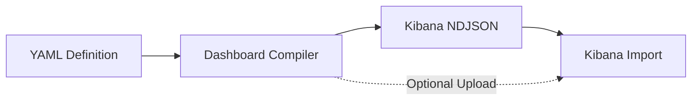

# YAML ➤ Lens Dashboard Compiler

Convert human-friendly YAML dashboard definitions into Kibana NDJSON format.

This tool simplifies the process of creating and managing Kibana dashboards by
allowing you to define them in a clean, maintainable YAML format instead of
hand-crafting complex JSON.

## Features

- **YAML-based Definition** – Define dashboards, panels, filters, and queries in simple, readable YAML.
- **Kibana Integration** – Compile to NDJSON format compatible with Kibana 8+.
- **Rich Panel Support** – Support for Lens (metric, pie, XY charts), Markdown, Links, Image, and Search panels.
- **Interactive Controls** – Add options lists, range sliders, and time sliders with chaining support.
- **Flexible Filtering** – Use a comprehensive filter DSL (exists, phrase, range) or raw KQL/Lucene/ESQL queries.
- **Direct Upload** – Compile and upload to Kibana in one step, with support for authentication and API keys.
- **Screenshot Export** – Generate high-quality PNG screenshots of your dashboards programmatically.

## Documentation Sections

### Getting Started

New users should begin here to learn the basics:

- **[Quickstart Guide](quickstart.md)** – Step-by-step guide for creating and compiling your first dashboard.
- **[CLI Reference](CLI.md)** – Detailed documentation of the `kb-dashboard` command-line tool.

### User Guide

Reference documentation for building dashboards in YAML:

- **[Dashboard Configuration](dashboard/dashboard.md)** – Dashboard-level settings and options.
- **[Panel Types](panels/base.md)** – Available panel types (Markdown, Charts, Images, Links, etc.).
- **[Dashboard Controls](controls/config.md)** – Interactive filtering controls.
- **[Filters & Queries](filters/config.md)** – Data filtering and query configuration.
- **[Complete Examples](examples/index.md)** – Real-world YAML dashboard examples.

### Developer Guide

Advanced documentation for contributors and programmatic usage:

- **[Architecture Overview](architecture.md)** – Technical design and data flow.
- **[Programmatic Usage](programmatic-usage.md)** – Using the Python API directly to generate dashboards.
- **[API Reference](api/index.md)** – Auto-generated Python API documentation.
- **[Contributing Guide](https://github.com/strawgate/kb-yaml-to-lens/blob/main/CONTRIBUTING.md)** – How to contribute and add new capabilities.
- **[Kibana Architecture Reference](kibana-architecture.md)** – Understanding Kibana's internal structure.
- **[Fixture Generator Guide](kibana-fixture-generator-guide.md)** – Generating test fixtures from live Kibana instances.

## Requirements

- Python 3.12+
- PyYAML 6.0+
- Pydantic 2.11.3+
- beartype 0.20.2+

## License

MIT

## Support

For issues and feature requests, please refer to the repository's issue tracker.
