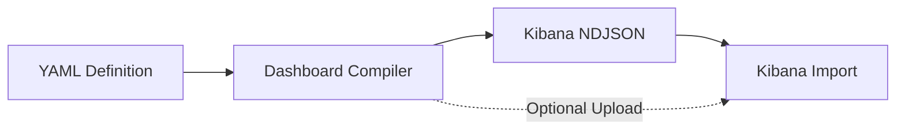

# YAML ➤ Lens Dashboard Compiler

Convert human-friendly YAML dashboard definitions into Kibana NDJSON format.


This tool simplifies the process of creating and managing Kibana dashboards by
allowing you to define them in a clean, maintainable YAML format instead of
hand-crafting complex JSON.



## Features

- **YAML-based Definition** – Define dashboards, panels, filters, and queries in simple, readable YAML.
- **Kibana Integration** – Compile to NDJSON format compatible with Kibana 8+.
- **Rich Panel Support** – Support for Lens (metric, pie, XY charts), Markdown, Links, Image, and Search panels.
- **Color Palettes** – Choose from color-blind safe, brand, and other built-in color palettes.
- **Interactive Controls** – Add options lists, range sliders, and time sliders with chaining support.
- **Flexible Filtering** – Use a comprehensive filter DSL (exists, phrase, range) or raw KQL/Lucene/ESQL queries.
- **Direct Upload** – Compile and upload to Kibana in one step, with support for authentication and API keys.
- **Screenshot Export** – Generate high-quality PNG screenshots of your dashboards programmatically.

## Getting Started

### Installation

This project uses [uv](https://github.com/astral-sh/uv) for fast, reliable Python package management:

```bash
# For development (includes testing, linting, type checking)
uv sync --group dev

# For building documentation
uv sync --group dev --group docs

# For runtime usage only
uv sync
```

For more information, see the [uv documentation](https://docs.astral.sh/uv/).

### Your First Dashboard

A basic dashboard YAML file has the following structure:

```yaml
dashboards:
-
  name: Your Dashboard Title
  description: An optional description
  panels:
    - # Your panel definitions go here
```

#### Example 1: Simple Markdown Panel

Here's a dashboard with a single markdown panel:

```yaml
dashboards:
- name: My First Dashboard
  description: A simple dashboard with markdown
  panels:
    - markdown:
        content: |
          # Hello, Kibana!

          This is my first markdown panel.
      grid: { x: 0, y: 0, w: 24, h: 15 }  # Half-width on 48-column grid
```

#### Example 2: Simple Lens Metric Panel

Here's a dashboard with a single Lens metric panel displaying a count:

```yaml
dashboards:
-
  name: Metric Dashboard
  description: A dashboard with a single metric panel
  panels:
    - type: lens
      grid: { x: 0, y: 0, w: 24, h: 15 }  # Half-width on 48-column grid
      index_pattern: your-index-pattern-*
      chart:
        type: metric
        metrics:
          - type: count
            label: Total Documents
```

### Programmatic Alternative

While this guide focuses on YAML, you can also create dashboards entirely in Python code! This approach offers:

- Dynamic dashboard generation based on runtime data
- Type safety with Pydantic models
- Reusable dashboard templates and components
- Integration with existing Python workflows

See the [Programmatic Usage Guide](programmatic-usage.md) for examples and patterns.

## Next Steps

### Learn More

- **[CLI Reference](CLI.md)** – Detailed documentation of the `kb-dashboard` command-line tool for compiling and uploading dashboards.
- **[VS Code Extension](vscode-extension.md)** – Live compilation, preview, and visual grid editing in Visual Studio Code.
- **[Complete Examples](examples/index.md)** – Real-world YAML dashboard examples covering various use cases.

### User Guide

Reference documentation for building dashboards in YAML:

- **[Dashboard Configuration](dashboard/dashboard.md)** – Dashboard-level settings and options.
- **[Panel Types](panels/base.md)** – Available panel types (Markdown, Charts, Images, Links, etc.).
- **[Dashboard Controls](controls/config.md)** – Interactive filtering controls.
- **[Filters & Queries](filters/config.md)** – Data filtering and query configuration.

### Developer Guide

Advanced documentation for contributors and programmatic usage:

- **[Architecture Overview](architecture.md)** – Technical design and data flow.
- **[Programmatic Usage](programmatic-usage.md)** – Using the Python API directly to generate dashboards.
- **[API Reference](api/index.md)** – Auto-generated Python API documentation.
- **[Contributing Guide](https://github.com/strawgate/kb-yaml-to-lens/blob/main/CONTRIBUTING.md)** – How to contribute and add new capabilities.
- **[Kibana Architecture Reference](kibana-architecture.md)** – Understanding Kibana's internal structure.
- **[Fixture Generator Guide](kibana-fixture-generator-guide.md)** – Generating test fixtures from live Kibana instances.

### More Examples

Refer to the example YAML files in the [`inputs/`](https://github.com/strawgate/kb-yaml-to-lens/tree/main/inputs) directory on GitHub for more complex examples.

## Requirements

- Python 3.12+

## License

MIT

## Support

For issues and feature requests, please refer to the repository's issue tracker.
